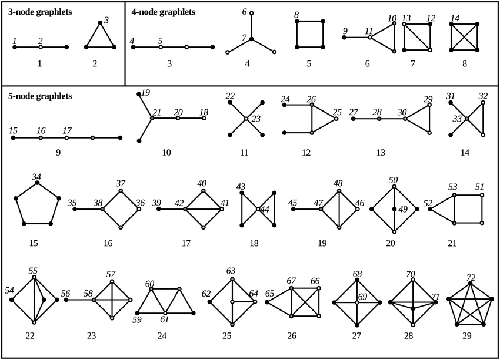
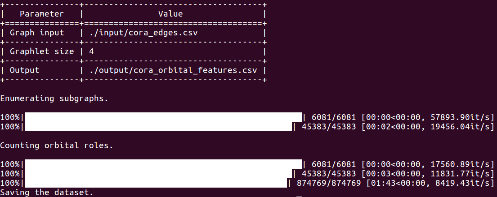

Orbital Strike
============================================
 [](https://codebeat.co/projects/github-com-benedekrozemberczki-orbitalfeatures-master) [](https://github.com/benedekrozemberczki/OrbitalFeatures/archive/master.zip)⠀[](https://twitter.com/intent/follow?screen_name=benrozemberczki)⠀


A **NetworkX** implementation of **Biological Network Comparison Using Graphlet Degree Distribution** (Bioinformatics 2007).
<p align="center">
  
</p>

### Abstract

<p align="justify">
Analogous to biological sequence comparison, comparing cellular networks is an important problem that could provide insight into biological understanding and therapeutics. For technical reasons, comparing large networks is computationally infeasible, and thus heuristics, such as the degree distribution, clustering coefficient, diameter, and relative graphlet frequency distribution have been sought. It is easy to demonstrate that two networks are different by simply showing a short list of properties in which they differ. It is much harder to show that two networks are similar, as it requires demonstrating their similarity in all of their exponentially many properties. Clearly, it is computationally prohibitive to analyze all network properties, but the larger the number of constraints we impose in determining network similarity, the more likely it is that the networks will truly be similar.</p>

This repository provides an implementation of Orbital Role Counting as described in the paper:

> Biological network comparison using graphlet degree distribution.
> Natasa Przulj.
> BioInformatics, 2007.
> [[Paper]](https://www.ncbi.nlm.nih.gov/pubmed/17237089)

### Requirements

The codebase is implemented in Python 3.5.2. package versions used for development are just below.
```
networkx          1.11
tqdm              4.28.1
numpy             1.15.4
pandas            0.23.4
texttable         1.5.0
argparse          1.1.0
```
### Datasets
<p align="justify">
The code takes the **edge list** of the graph in a csv file. Every row indicates an edge between two nodes separated by a comma. The first row is a header. Nodes should be indexed starting with 0. A sample graph for `Cora` is included in the `input/` directory.</p>

### Options

Training the model is handled by the `src/main.py` script which provides the following command line arguments.

#### Input and output options

```
  --graph-input    STR   Input graph path.       Default is `input/cora_edges.csv`.
  --output         STR   Features path.          Default is `output/cora_orbital_features.csv`.
  --graphlet-size  INT   Maximal subgraph size.  Default is 4.
```

### Examples

The following command extracts the orbital role counts from the induced subgraphs up to the graphlet size order. The first column of the output is the node identifier and features are sorted by node identifiers.

```sh
$ python src/main.py
```

<p align="center">

</p>

Extracting the counts for graphlets with size 5.

```sh
$ python src/main.py --graphlet-size 5
```


--------------------------------------------------------------------------------

**License**

- [GNU](https://github.com/benedekrozemberczki/OrbitalFeatures/blob/master/LICENSE)
